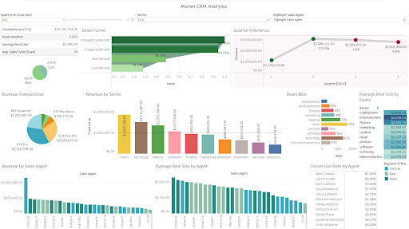

# Maven Analytics CRM Opportunities Analysis (2017)

Analyzing sales pipeline data from a fictitious B2B computer hardware sales company. Data sourced from Maven Analytics. Find the interactive Tableau dashboard [here](https://public.tableau.com/app/profile/brian.laluces/viz/MavenCRMAnalysis/MavenHardwareCRMAnalytics).

## Key Metrics
| Metric | Definition | Importance |
| ----------- | ----------- | ----------- |
| Total Revenue | Sum of all revenue generated from sales | Measures financial health, tracks growth, and informs resource allocation |
| Sales Pipeline Conversion Rate | Percentage of deals moving through sales pipeline stages to closed-won | Provides insights into sales process efficiency, identifies bottlenecks |
| Average Deal Size | Average value of closed-won deals | Evaluates revenue contribution, informs sales strategy, aids market positioning |

## Summary of Insights
### Overall Revenue Trend
- There were no recorded deal closures in the first two months of Q1, resulting in a huge jump in revenue from Q1 to Q2 before reaching relative stability for the rest of the year. This warrants an investigation into the reason for the lack of revenue made in January and February of 2017.
- Revenue dropped by 3% in Q3 2017 from Q2, and then another 6% in Q4 from Q3. The consecutive quarterly revenue declines highlight underlying issues that need to be addressed urgently. A comprehensive analysis of market conditions, competitive landscape, and internal operations is essential to identify the root causes and implement corrective actions.
### Products
- GTX products account for nearly 75% of total revenue in 2017, with the GTX Pro and GTX Plus Pro being the top revenue-generating products. The heavy reliance on GTX products, particularly the GTX Pro and GTX Plus Pro, makes the company vulnerable to fluctuations in their sales. The significant contraction in sales of these products is a primary contributor to the observed slowdown in overall revenue growth.
- Revenue from GTX Pro in the telecommunications sector decreased by 50% from Q3 to Q4. The steep decline in GTX Pro sales within the telecommunications sector highlights potential market saturation or increased competition. This sector-specific downturn is critical, given the product's substantial contribution to overall revenue.
- MG Special products are the second most popular but generate the least revenue (<1%) due to their low sales price compared to other company products. Despite their popularity, the low pricing strategy for MG Special products significantly limits their revenue contribution.
### Sectors
- The retail sector generates the most revenue, likely due to the high demand for POS hardware in in-person retail shopping. The dominance of the retail sector underscores the importance of maintaining strong relationships and support in this market. However, the technology sector, despite leading in deals won in Q2, shows a declining trend in deals throughout the year, suggesting a need for renewed focus and strategy adjustment in the technology market.
- The medical sector was mainly responsible for the lower revenue in Q3, experiencing a decline of ~24.4%, followed by a modest rebound of ~8.4% in Q4. The significant revenue drop in the medical sector during Q3 suggests potential issues such as budget cuts, market changes, or competitive pressures. The slight rebound in Q4 indicates recovery efforts are underway but need further support to regain momentum.
- The average deal size in the telecom sector decreased by $1,000 from Q3 to Q4, with the number of deals remaining stable (77 to 78), resulting in a $70,000 revenue difference. The reduction in average deal size in the telecom sector, despite a stable number of deals, points to a shift towards smaller contracts or price reductions.
### Agent Performance
- The Central office lags behind other regions in terms of total revenue and deal size, except for Daniel S., who displayed exemplary performance across all regional offices.
- The Eastern office shows the greatest quarter-over-quarter decline in revenue throughout 2017. The Western office had a smaller decline, while the Central office demonstrated revenue growth until Q4.
## Recommendations and Next Steps
- Investigate the reasons for the decrease in deal size in the telecom sector and develop strategies to secure larger contracts or introduce value-added services.
- Diversify the product portfolio to reduce dependency on GTX products and explore marketing strategies to boost sales of other products.
- Evaluate the pricing strategy for MG Special products and consider bundling them with higher-priced items to increase their overall revenue contribution.
- Strengthen engagement and support in the retail sector while reassessing and revitalizing the strategy for the technology sector to address the decline in deals.
- Investigate the reasons for the decrease in deal size in the telecom sector, such as competitor actions or changes in customer needs, and develop strategies to secure larger contracts or introduce value-added services.
- Analyze Daniel S.'s sales techniques and strategies to identify best practices that can be implemented by other sales agents. Address any management or resource allocation issues that may be hindering overall performance in the central office.
- Conduct a thorough analysis of the eastern office's performance to identify the factors contributing to the revenue decline. Develop and implement strategies to address these issues and stimulate growth in this region.
## Limits to Analysis and Further Information Needed
To conduct a better analysis of the company’s performance and inform the actions the company must take to recover from the declining sales growth rate, other data that would typically be in the possession of a B2B retail company should be looked at in conjunction with the datasets provided. This includes:
More information on the products themselves, such as COGS and functions/purposes of products  
The length a deal has spent in each stage of the sales funnel
Data on transactions from previous years, to better contextualize quarterly trends

Thank you so much for checking out my CRM Analytics Project! This is my first business-oriented dashboard, so feedback is especially welcome, and I hope you’ll check out the other projects on my page!
