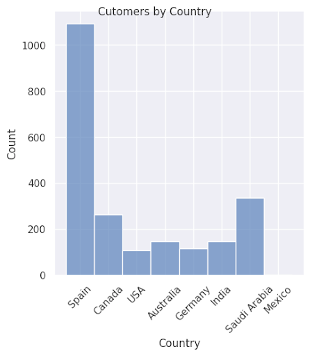
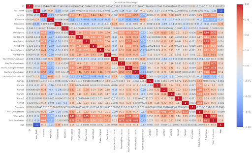
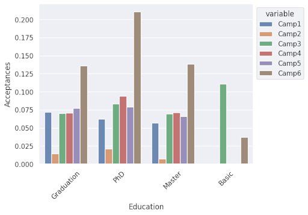

# Exploratory Marketing Data Analysis

## Introduction
As a data analyst trying to start their career on a strong foot, I understand the need to show employers and those in my network both technical skills and business savvy. That is why I have conducted exploratory data analysis on a digital marketing dataset provided by Maven Analytics. I used Python to complete this project, as I wanted to highlight my interest in coding and technical skills with the relevant python libraries (pandas, numpy, matplotlib, seaborne).

The description of the dataset on Maven Analytics’ Data Playground page:
“Marketing campaign data of 2,240 customers of Maven Marketing, including customer profiles, product preferences, campaign successes/failures, and channel performance.”

For this project, I have conducted EDA on this dataset to uncover any trends in consumer preference/behavior and answer the following questions:
1. Are there any null values or outliers? How will you handle them?
2. What factors are significantly related to the number of web purchases?
3. Which marketing campaign was the most successful?
4. What does the average customer look like?
5. Which products are performing best?
6. Which channels are underperforming?

## Data Preprocessing
My first step in working with this dataset was inspecting and getting acquainted with the data. After importing the necessary libraries and reading the dataset, I used descriptive functions such as pd.shape(),  pd.head(), and pd.datatypes() to look at the column names, values, and datatypes. Then I chose to check the unique values of both categorical variables (string values) and boolean values (represented in this dataset as integers 0 and 1) for any values that needed to be further examined. 

Other steps taken in Data Cleaning:
* Checked for outliers for numerical values
* Checked for duplicates and rows with null values
* Converted the date column to datetime
* Renamed columns for ease of use and readability

Before moving on to the analysis, I also decided to aggregate data into these columns: Total Value, Total Purchases, and Total Conversions. These columns would allow me to get a more holistic view of customer’s behavior.

## Analysis & Visualizations
My analysis started with histograms and box charts to acquaint myself with the general distribution of categorical and quantitative variables. Despite the simplicity of the visualizations, I uncovered several characteristics of the dataset that were crucial in answering several of the business questions listed above. For example, I found that over half of the customers in this dataset reside in Spain. This not only helped me form an image of the average customer, but also informed further analysis that was conducted later in the project.

Moving from single-variable analysis, I constructed a correlation heatmap to identify which variables were strongly correlated:

Most of the strong correlations were found in my aggregations, which did not reveal anything not already known/worth looking into. Looking back at the original variables, I decided to look at relationships not considered statistically strong, but had correlation coefficients hovering around 0.5. From there, I created a pairplot to see if any variables had non-linear correlations.

The last major step of my analysis was comparing customer behavior across several demographic categories. For these graphs, I created multiple box and bar plots.

## Conclusions
While no factors can be considered statistically significant to the number of web purchases, the most significant factors are the amount customers spend on wine and gold, with a less significant factor being income.

Campaign 6 was the best performing ad campaign overall, but there are some things to note about other campaigns:
* Those with basic education only responded to Campaigns 3 and 6. 
* Campaign 2 was the worst performing campaign across countries and education statuses. 
* Those with PhDs responded especially well to Marketing Campaigns on average,  and responded to Campaigns 3 and 4. 
* Campaigns 1, 3, 4, and 5 performed similarly.

The average customer looks like: married 40-50 year olds living in Spain with an undergraduate degree, no kids, and  around 50,000 USD in income.

Wine and meat products are the best performing products by far.

While I don’t have a benchmark for the performance of sales channels, I can say that in-store shopping is the most popular method of shopping, with web shopping and catalog shopping in second and third, respectively. This is consistent across geographical locations.

## Recommendations
On the whole, base future campaigns on Campaign 6. Look into increasing efforts in countries besides Spain with higher average total value. Focus more of the Web Shopping experience on wine and gold, more leisure/luxury items, as opposed to grocery items. Physical stores remain the most popular way of shopping across ages and geographic locations, so attention should be paid to optimizing the in-store shopping experience. Prioritize offers on meat and wine, centering advertisements and promotions more on those two product categories. The business should also focus on advertising to the average consumer: Spanish 40-50 year olds with around 50,000 USD in income.

Thank you for taking the time to check out my project! Constructive feedback is welcome and appreciated!
